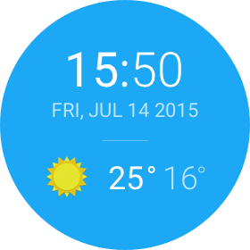

#### Project Overview

In this project, you will build a wearable watch face for Sunshine to run on an Android Wear device.

#### Why this Project

Android Wear is an exciting way to integrate your app more directly into users’ lives. As a new developer, it will be important for you to understand how to perform this integration. This project gives you an opportunity to design a companion app for Sunshine, tying it to a watch face in order to enrich the experience.

#### What Will I Learn?

Through this project, you will:
* Understand the fundamentals of Android Wear.
* Design for multiple watch form factors.
* Communicate between a mobile device and a wearable device.

#### How Will I Complete this Project?

##### Required Tasks

* Clone/Download a zip file of the final branch of Sunshine from Advanced Android App Development.
* Spend time exploring the samples built into Android Studio, looking for ways to incorporate that functionality into an Android Wear watchface.
Design Mocks
* Feel free to use the following square and round designs as a design reference.

 

But certainly feel free to customize and create per your own taste and preferences!
